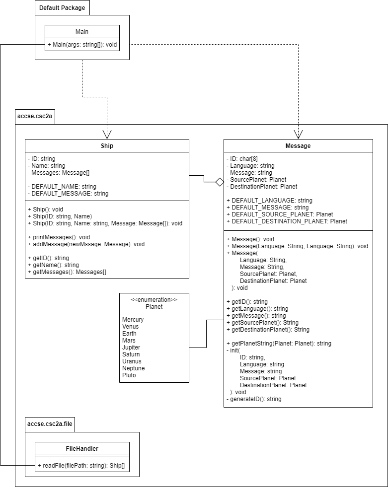

# UJ CSC2A Practical 3

## Table of content

- [Additional Information](#additional-information)
- [Class Structure](#class-structure)
- [Changes To the Original Classes](#changes-to-the-original-classes)
    * [Ship's new Constructors & Method](#ship-s-new-constructors---method)
    * [Message's new Constructors & Method](#message-s-new-constructors---method)
        + [StringToPlanet method](#stringtoplanet-method)
        + [Exceptions](#exceptions)
- [Appending Array function , Generics & p03_utils](#appending-array-function---generics---p03-utils)
- [Reading files](#reading-files)
    * [ARM (Automatic Resource Management)](#arm--automatic-resource-management-)
    * [Reading file contents](#reading-file-contents)

## Additional Information

This practical adds on to the [previous practical (Prac02)](https://github.com/ThaBeanBoy/UJ_CSC2A_P02), you can find the
changes additions to the assignment here - [Assignment](./docs/Assignment.pdf)

## Class Structure



## Changes To the Original Classes

### Ship's new Constructors & Method
I had to add new constructors to the Message & Ship constructors. Consequently, I had to overload the ```intit``` method,
this time, the new init method takes a ID instead of auto generating a new ID. The new constructors are the same, these
new constructors just take a ID instead of auto-generating the ID.

The reason why I added an ```addMessage``` method was because while reading the file, I needed a way to inject ```Message```
objects in a ```Ship``` object that had already been instantiated. The files started with the ```Ship``` details, then 
the ```Message``` details followed along.

```java
public class Ship {
    public Ship(String ID, String Name) {
        this.init(ID, Name, DEFAULT_MESSAGES);
    }

    public Ship(String ID, String Name, Message[] Messages) {
        this.init(ID, Name, Messages);
    }

    private void init(String ID, String Name, Message[] Messages) {
        // ID isn't auto generated, it's now provided
        this.ID = ID;
        this.Name = Name;
        this.Messages = Messages;
    }

    public void addMessage(Message newMessage){
        this.Messages = p03_utils.appendArray(this.Messages, newMessage);
    }
}
```

### Message's new Constructors & Method

All the reasoning stated in the [section above](#Ship's-new-Constructors-&-Method) was also applied to the Message class.
But this might require an extensive explanation.

#### StringToPlanet method

This method is meant to recognise a string & convert it into a ```Planet``` enumeration. In the switch case, the input
string is converted into lower case ```Planet.toLowerCase()``` to make sure that it can return a Planet without having to
worry about any upper case characters.

This method is mainly used in the constructors, 2 of the constructor methods accept planets as a string, which need to
be converted into the appropriate data type.

It was also made public to make it accessible in other classes & files in the event it is needed elsewhere. 

#### Exceptions

The ```StringToPlanet``` throws an ```InvalidPlanetString``` exception. This fell under the default case in the switch
statement. The reason why it throws an ```InvalidPlanetString``` exception is because the planet string may be inrecogniseable.
Only 2 constructors throw this exception since the ```SourcePlanet``` & ```DestinationPlanet``` arguments can be passed
as strings

```java
public class Message{
    public Message(String ID, String Language, String Message, Planet SourcePlanet, Planet DestinationPlanet){
        this.init(ID, Language, Message, SourcePlanet, DestinationPlanet);
    }

    public Message(String Language, String Message, String SourcePlanet, String DestinationPlanet) throws InvalidPlanetString {
        try{
            this.init(Language, Message, SourcePlanet, DestinationPlanet);
        }catch(InvalidPlanetString exception){
            throw new InvalidPlanetString();
        }
    }

    public Message(String ID, String Language, String Message, String SourcePlanet, String DestinationPlanet) throws InvalidPlanetString{
        try{
            this.init(ID, Language, Message, SourcePlanet, DestinationPlanet);
        }catch(InvalidPlanetString exception){
            throw new InvalidPlanetString();
        }
    }

    private void init(String Language, String Message, String SourcePlanet, String DestinationPlanet) throws InvalidPlanetString{
        try{
            this.ID = ID_Generator.Generate("MSG", 6, Message_No);
            Message_No++;

            this.Language = Language;
            this.Message = Message;
            this.SourcePlanet = StringToPlanet(SourcePlanet);
            this.DestinationPlanet = StringToPlanet(DestinationPlanet);
        }catch(InvalidPlanetString exception){
            throw new InvalidPlanetString();
        }
    }

    private void init(String ID, String Language, String Message, Planet SourcePlanet, Planet DestinationPlanet){
        this.ID = ID;

        this.Language = Language;
        this.Message = Message;
        this.SourcePlanet = SourcePlanet;
        this.DestinationPlanet = DestinationPlanet;
    }

    private void init(String ID, String Language, String Message, String SourcePlanet, String DestinationPlanet) throws InvalidPlanetString{
        try{
            this.ID = ID;

            this.Language = Language;
            this.Message = Message;
            this.SourcePlanet = StringToPlanet(SourcePlanet);
            this.DestinationPlanet = StringToPlanet(DestinationPlanet);
        }catch(InvalidPlanetString exception){
            throw new InvalidPlanetString();
        }
    }

    public static Planet StringToPlanet(String Planet) throws InvalidPlanetString{
        return switch(Planet.toLowerCase()){
            case "mercury" -> Mercury;
            case "venus" -> Venus;
            case "earth" -> Earth;
            case "mars" -> Mars;
            case "jupiter" -> Jupiter;
            case "saturn" -> Saturn;
            case "uranus" -> Uranus;
            case "neptune" -> Neptune;
            case "pluto" -> Pluto;
            default -> throw new InvalidPlanetString();
        };
    }

    public static class InvalidPlanetString extends Exception{}
}
```

## Appending Array function , Generics & p03_utils

I asked the lecturer if we could use ```ArrayList``` for this practical, unfortunately he said they were not allowed, & we
manually had to increase the size of the array. During the practical, I noticed that I had to deal with 2 arrays, a ```Ship[]```
& ```Message[]``` arrays. I realised that not only would I create a function for appending to an array, but I'd have to create
2 seperate functions that used the same logic. This is where generics are involved.

Arrays in java have a fixed length, so I had to make a new array that's 1 length bigger than the original array. After, I'd
have to copy the elements from the original array to the new array. Luckily, the ```Array.copyOf``` does the last 2 statements 
in 1 line. Once that is done, the new element is then appended to the array, since the new array has enough space for the 
new element. Once all of this done, we can return the new array.

```java
public class p03_utils {
    public static <T> T[] appendArray(T[] arr, T newElement) {
        // Copying array content
        T[] newArr = Arrays.copyOf(arr, arr.length + 1);
        newArr[newArr.length - 1] = newElement;
        return newArr;
    }
}
```

process of appending the array

## Reading files
This is the main focus of the practical, reading from a file. 

### ARM (Automatic Resource Management)
The lecturer instructed us to use Automatic Resource Management, & from using it, I have to say that I completely love it.
It automatically closes resources that would otherwise need you to manually close it. I know it may seem like a small thing,
but in a world where humans are programmers, this is one less place where we can make errors.

```java
public class fileHandler{
    public static Ship[] readFile(String filePath) {
        File handle = new File(filePath);

        try (Scanner lines = new Scanner(handle)) {
            // Handling the fi
        }catch(FileNotFoundException exception){
            // Catch block that catches FileNotFoundException exception 
        }
    }
}
```

### Reading file contents

Using a Scanner object, it makes it easier to read & interact with every line in a file using a while loop.

```java
public class fileHandler{
    public static Ship[] readFile(String filePath) {
        File handle = new File(filePath);

        try (Scanner lines = new Scanner(handle)) {
            String[] words = line.split(" ");

            Matcher ShipMatcher = ShipID_Pattern.matcher(words[0]);
            Matcher MessageMatcher = MessageID_Pattern.matcher(words[0]);

            if(ShipMatcher.matches()){
                // create a ship object
            }
            else if (MessageMatcher.matches()){
                // create a Message object
                // inject the created Message into the latest ship in the Ships array
            }
        }catch(FileNotFoundException exception){
            // Catch block that catches FileNotFoundException exception 
        }
    }
}
```

For each line, I split the different words into an array of strings using the ```line.split(" ")``` method, this way, I 
could deal with the different properties of the Ship/Message class. 

Using regex, I could then test whether the first word (```words[0]```) reflects the ID of a Ship or Message. the following 
are the regex for Message & Ship IDs:
- Ship    - ```SH\d{4}```
- Message - ```MSG\d{6}```

In the event that it was a Ship ID, a ```Ship``` was generated with the relavent information, & appended to the Ships array.
In the event that it was a Message ID, a ```Message``` was generated with the relavent information, & it would be injected
into the last Ship in the Ship array.
In the even that the ID did not match any of the ID formats, the error would be appended to the erroLogs array which would
later be printed in the console.